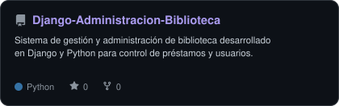
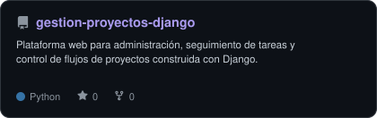
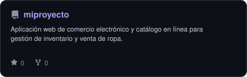
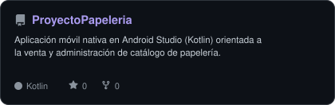
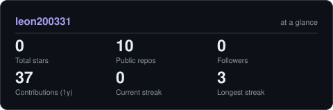

<!-- BANNER PRINCIPAL (TERMINAL SVG) -->
<picture>
  <source media="(prefers-color-scheme: dark)"  srcset="assets/banner-dark.v9.svg">
  <source media="(prefers-color-scheme: light)" srcset="assets/banner-light.v9.svg">
  
</picture>

 

<!-- ENCABEZADO ANIMADO -->

  

<!-- REDES Y CONTACTO -->
&nbsp;&nbsp;
&nbsp;&nbsp;
&nbsp;&nbsp;
&nbsp;&nbsp;

  

---

## ⚡ Sobre mí

<table>
<tr>
<td width="55%" valign="top">

### 💻 Enfoque Técnico & Arquitectura

Ingeniero en Sistemas Computacionales enfocado en el desarrollo backend, diseño de arquitecturas web confiables y optimización de bases de datos relacionales.

* **Desarrollo Backend:** Creación y consumo de APIs REST, lógica de negocio y aplicaciones web modulares con **Python (Django)** y **PHP (Laravel)**.
* **Bases de Datos & SQL:** Modelado relacional, diseño de esquemas, normalización y optimización de consultas complejas en **MySQL** y **PostgreSQL**.
* **Ecosistema Móvil:** Implementación de interfaces interactivas y lógica de cliente nativa con **Android Studio (Kotlin)**.
* **Flujos de Trabajo:** Control de versiones con **Git**, automatización de tareas con **GitHub Actions** y seguimiento de buenas prácticas de código limpio.

</td>
<td width="45%" valign="top">

### 📌 Información General

* 📍 **Ubicación:** Chiapas, México
* 🎓 **Formación:** Ing. en Sistemas Computacionales (ITTG)
* 💼 **Especialidad:** Backend Architecture, REST APIs & SQL
* 🚀 **Estado:** Disponible para proyectos colaborativos y desarrollo de software

 

**Tecnologías Principales:**
 

</td>
</tr>
</table>

 

## 🛠️ Stack de Tecnologías

---

## 🚀 Proyectos Destacados

<table>
<tr>
<td width="50%" align="center">
  <a href="https://github.com/leon200331/Django-Administracion-Biblioteca">
    <picture>
      <source media="(prefers-color-scheme: dark)" srcset="assets/card-Django-Administracion-Biblioteca-dark.svg">
      <source media="(prefers-color-scheme: light)" srcset="assets/card-Django-Administracion-Biblioteca-light.svg">
      
    </picture>
  </a>
</td>
<td width="50%" align="center">
  <a href="https://github.com/leon200331/gestion-proyectos-django">
    <picture>
      <source media="(prefers-color-scheme: dark)" srcset="assets/card-gestion-proyectos-django-dark.svg">
      <source media="(prefers-color-scheme: light)" srcset="assets/card-gestion-proyectos-django-light.svg">
      
    </picture>
  </a>
</td>
</tr>
<tr>
<td width="50%" align="center">
  <a href="https://github.com/leon200331/miproyecto">
    <picture>
      <source media="(prefers-color-scheme: dark)" srcset="assets/card-miproyecto-dark.svg">
      <source media="(prefers-color-scheme: light)" srcset="assets/card-miproyecto-light.svg">
      
    </picture>
  </a>
</td>
<td width="50%" align="center">
  <a href="https://github.com/leon200331/ProyectoPapeleria">
    <picture>
      <source media="(prefers-color-scheme: dark)" srcset="assets/card-ProyectoPapeleria-dark.svg">
      <source media="(prefers-color-scheme: light)" srcset="assets/card-ProyectoPapeleria-light.svg">
      
    </picture>
  </a>
</td>
</tr>
</table>

---

## 📊 Radar de Especialidad

<table>
<tr>
<td width="50%" align="center" valign="middle">

<!-- Radar de habilidades - generado por scripts/radar.py usando assets/skills.json -->
<picture>
  <source media="(prefers-color-scheme: dark)"  srcset="assets/radar-dark.svg">
  <source media="(prefers-color-scheme: light)" srcset="assets/radar-light.svg">
  
</picture>

</td>
<td width="50%" align="center" valign="middle">

<!-- Radar de lenguajes -->
<picture>
  <source media="(prefers-color-scheme: dark)"  srcset="assets/radar-langs-dark.svg">
  <source media="(prefers-color-scheme: light)" srcset="assets/radar-langs-light.svg">
  
</picture>

</td>
</tr>
</table>

---

## 📈 Rendimiento & Estadísticas

<picture>
  <source media="(prefers-color-scheme: dark)"  srcset="assets/card-stats-dark.svg">
  <source media="(prefers-color-scheme: light)" srcset="assets/card-stats-light.svg">
  
</picture>

 

---

Desarrollado por [Leonardo Gonzalez](https://github.com/leon200331)

